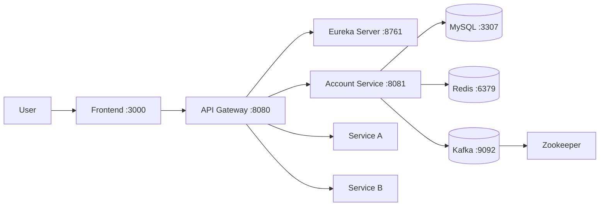

# Finance Microservices Platform

[](LICENSE)

> A microservices-based personal finance management platform built with Spring Boot, Spring Cloud, Kafka, MySQL, and Redis.

> **New to this repo?** See [`GETTING_STARTED.md`](GETTING_STARTED.md) for setup instructions and workflow guide.

---

## Team Members

| Name | Student ID | Role | Services |
|------|------------|------|---------|
| Thanh vien 1 (TV1) | | Infrastructure + Account | eureka-server, api-gateway, account-service |
| Thanh vien 2 (TV2) | | Service A | service-a |
| Thanh vien 3 (TV3) | | Service B + Frontend | service-b, frontend |

---

## Business Process

Finance platform automating account management, KYC verification, payments, and transaction reporting for Vietnamese banking users.

---

## Architecture



| Component            | Responsibility                         | Tech Stack                     | Port |
|----------------------|----------------------------------------|--------------------------------|------|
| **Frontend**         | Web UI                                 | (TV3 choice)                   | 3000 |
| **API Gateway**      | JWT auth, rate limiting, routing       | Spring Cloud Gateway           | 8080 |
| **Eureka Server**    | Service registry and discovery         | Spring Cloud Netflix Eureka    | 8761 |
| **Account Service**  | Accounts, KYC, authentication          | Spring Boot, MySQL, Kafka      | 8081 |
| **Service A**        | (TV2 service)                          | (TV2 choice)                   | -    |
| **Service B**        | (TV3 service)                          | (TV3 choice)                   | -    |
| **MySQL**            | Account data persistence               | MySQL 8.0                      | 3307 |
| **Redis**            | Rate limiting, token blacklist         | Redis 7-alpine                 | 6379 |
| **Kafka**            | Async events (account.created, etc.)   | Confluent Kafka 7.6.0          | 9092 |

---

## Getting Started

```bash
# Clone and initialize
git clone https://github.com/jnp2018/Finance.git
cd Finance
cp .env.example .env

# Build and run
docker compose up --build
```

### Verify TV1 Services

```bash
# Service registry
curl http://localhost:8761/actuator/health

# API Gateway health
curl http://localhost:8080/actuator/health

# Account service (via gateway)
curl http://localhost:8080/api/v1/accounts/health

# Login
curl -X POST http://localhost:8080/api/v1/auth/login \
  -H "Content-Type: application/json" \
  -d '{"account_number":"FIN0000000000001","password":"password123"}'
```

---

## API Documentation

- [Account Service — OpenAPI Spec](docs/api-specs/account-service.yaml)
- [Service A — OpenAPI Spec](docs/api-specs/service-a.yaml)
- [Service B — OpenAPI Spec](docs/api-specs/service-b.yaml)

---

## TV1 Services Detail

### Eureka Server (port 8761)
Service registry for all microservices. Provides service discovery via DNS-based load balancing.
- Dashboard: `http://localhost:8761` (admin / admin123)
- See: [`services/eureka-server/readme.md`](services/eureka-server/readme.md)

### API Gateway (port 8080)
Single entry point for all client requests. Handles JWT authentication, rate limiting, circuit breaking, and routing.
- See: [`gateway/readme.md`](gateway/readme.md)

### Account Service (port 8081)
Manages user accounts, KYC documents, authentication, and account operations.
- See: [`services/account-service/readme.md`](services/account-service/readme.md)

---

## License

This project uses the [MIT License](LICENSE).
