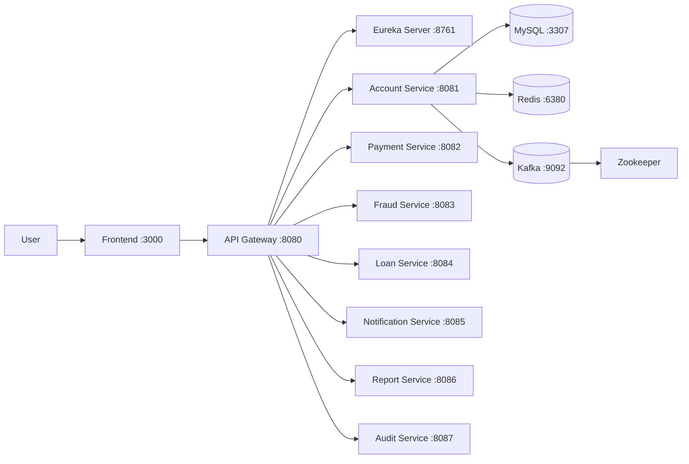

# Finance Microservices Platform

[](LICENSE)

> A microservices-based personal finance management platform built with Spring Boot, Spring Cloud, Kafka, MySQL, and Redis.

> **New to this repo?** See [`GETTING_STARTED.md`](GETTING_STARTED.md) for setup instructions and workflow guide.

---

## Team Members

| Name | Student ID | Role | Services |
|------|------------|------|---------|
| Thanh vien 1 (TV1) | | Infrastructure + Account | eureka-server, api-gateway, account-service |
| Thanh vien 2 (TV2) | | Payment + Fraud | payment-service, fraud-service |
| Thanh vien 3 (TV3) | | Loan, Notification + Frontend | loan-service, notification-service, frontend |
| Thanh vien 4 (TV4) | | Report, Audit | report-service, audit-service |

---

## Business Process

Finance platform automating account management, KYC verification, payments, and transaction reporting for Vietnamese banking users.

---

## Architecture



| Component            | Responsibility                         | Tech Stack                     | Port |
|----------------------|----------------------------------------|--------------------------------|------|
| **Frontend**         | Web UI                                 | React, TypeScript, Tailwind    | 3000 |
| **API Gateway**      | JWT auth, rate limiting, routing       | Spring Cloud Gateway           | 8080 |
| **Eureka Server**    | Service registry and discovery         | Spring Cloud Netflix Eureka    | 8761 |
| **Account Service**  | Accounts, KYC, authentication          | Spring Boot, MySQL, Kafka      | 8081 |
| **Payment Service**  | Payment processing, transaction storage| Spring Boot, MySQL, Redis      | 8082 |
| **Fraud Service**    | Fraud detection, risk evaluation       | Spring Boot, MySQL, Redis      | 8083 |
| **Loan Service**     | Loan management and evaluation         | Spring Boot, MySQL, MongoDB    | 8084 |
| **Notification**     | Email/SMS notifications via events     | Spring Boot, MongoDB, Kafka    | 8085 |
| **Report Service**   | Statement generation and analytics     | Spring Boot, MongoDB, Kafka    | 8086 |
| **Audit Service**    | Operational traceability log           | Spring Boot, MongoDB, Kafka    | 8087 |
| **MySQL (x4)**       | Relational persistence                 | MySQL 8.0                      | 3307-3310 |
| **MongoDB**          | NoSQL persistence                      | MongoDB 7.0                    | 27017|
| **Redis**            | Rate limiting, cache, session          | Redis 7-alpine                 | 6380 |
| **Kafka**            | Async events                           | Confluent Kafka 7.6.0          | 9092 |

---

## Getting Started

```bash
# Clone and initialize
git clone https://github.com/jnp2018/Finance.git
cd Finance
cp .env.example .env

# Build and run
docker compose up -d --build
```

### Verify Services

```bash
# Service registry
curl http://localhost:8761/actuator/health

# API Gateway health
curl http://localhost:8080/actuator/health

# Account service (via gateway)
curl http://localhost:8080/api/v1/accounts/health

# Login (Demo)
curl -X POST http://localhost:8080/api/v1/auth/login \
  -H "Content-Type: application/json" \
  -d '{"account_number":"FIN0000000000001","password":"password123"}'
```

---

## API Documentation (Swagger UI)

All backend microservices feature auto-generated OpenAPI Documentation. You can view, test, and explore all REST endpoints via the Swagger UI available on each service:

- [Account Service — Swagger UI](http://localhost:8081/swagger-ui/index.html)
- [Payment Service — Swagger UI](http://localhost:8082/swagger-ui/index.html)
- [Fraud Service — Swagger UI](http://localhost:8083/swagger-ui/index.html)
- [Loan Service — Swagger UI](http://localhost:8084/swagger-ui/index.html)
- [Notification Service — Swagger UI](http://localhost:8085/swagger-ui/index.html)
- [Report Service — Swagger UI](http://localhost:8086/swagger-ui/index.html)
- [Audit Service — Swagger UI](http://localhost:8087/swagger-ui/index.html)

> 🔐 **Testing with Authorization:** To test protected endpoints, log in via the Frontend (`http://localhost:3000`), copy the `access_token` from your Browser's Network request, and paste it into the **`[Authorize] 🔓`** button inside Swagger.

---

## TV1 Services Detail

### Eureka Server (port 8761)
Service registry for all microservices. Provides service discovery via DNS-based load balancing.
- Dashboard: `http://localhost:8761` (admin / admin123)
- See: [`services/eureka-server/readme.md`](services/eureka-server/readme.md)

### API Gateway (port 8080)
Single entry point for all client requests. Handles JWT authentication, rate limiting, circuit breaking, and routing.
- See: [`gateway/readme.md`](gateway/readme.md)

### Account Service (port 8081)
Manages user accounts, KYC documents, authentication, and account operations.
- See: [`services/account-service/readme.md`](services/account-service/readme.md)

---

## TV2 Services Detail

### Payment Service (port 8082)
Payment processing service for the finance system. It manages payment flows, stores transactions, publishes Kafka events, and uses Redis for temporary and cached data.
- See: [`services/payment-service/readme.md`](services/payment-service/readme.md)

### Fraud Service (port 8083)
Fraud detection and transaction risk evaluation service. It handles fraud data, consumes and publishes Kafka events, and uses Redis for fast lookups.
- See: [`services/fraud-service/readme.md`](services/fraud-service/readme.md)

---

## TV3 & TV4 Services Detail

### Frontend (port 3000)
User-facing web application for customers and admin users. All client requests go through the API Gateway instead of calling backend services directly.
- See: [`frontend/readme.md`](frontend/readme.md)

### Loan Service (port 8084)
Loan management service for the finance system. It handles loan applications, credit score evaluation, review workflow, and approval support.
- See: [`services/loan-service/readme.md`](services/loan-service/readme.md)

### Notification Service (port 8085)
Notification processing service for email, SMS, and push delivery. It consumes Kafka events and records notification activity for support and monitoring.
- See: [`services/notification-service/readme.md`](services/notification-service/readme.md)

### Report Service (port 8086)
Reporting service for statements, monthly summaries, and frontend analytics. It builds reporting data for dashboards and export features.
- See: [`services/report-service/readme.md`](services/report-service/readme.md)

### Audit Service (port 8087)
Audit and monitoring service for operational traceability. It stores immutable audit logs for support and admin users.
- See: [`services/audit-service/readme.md`](services/audit-service/readme.md)

---

## License

This project uses the [MIT License](LICENSE).
