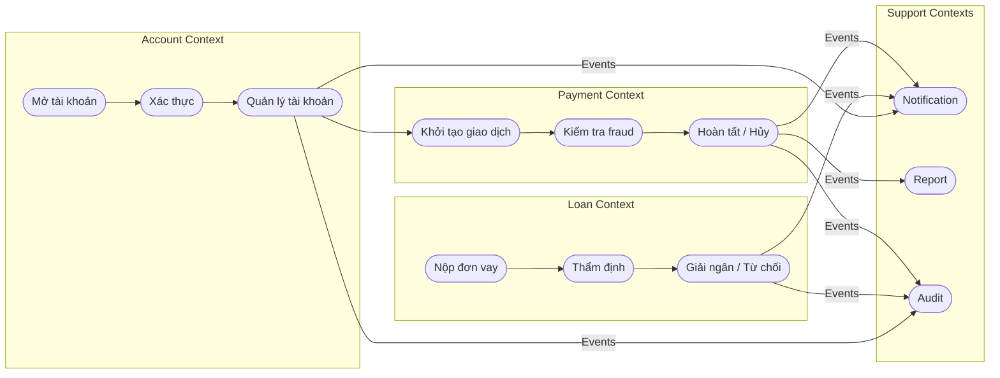
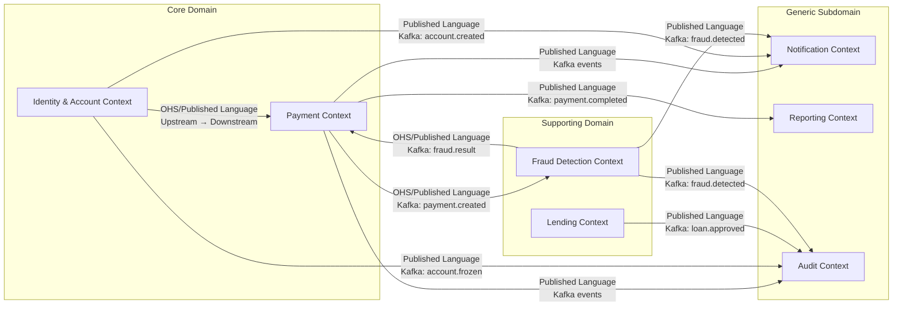
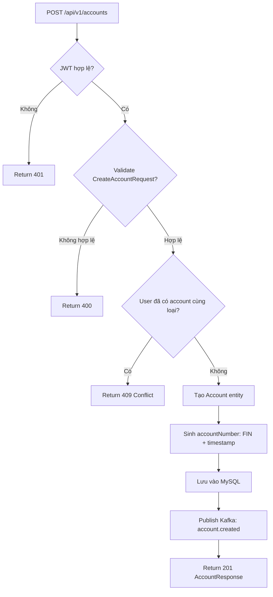
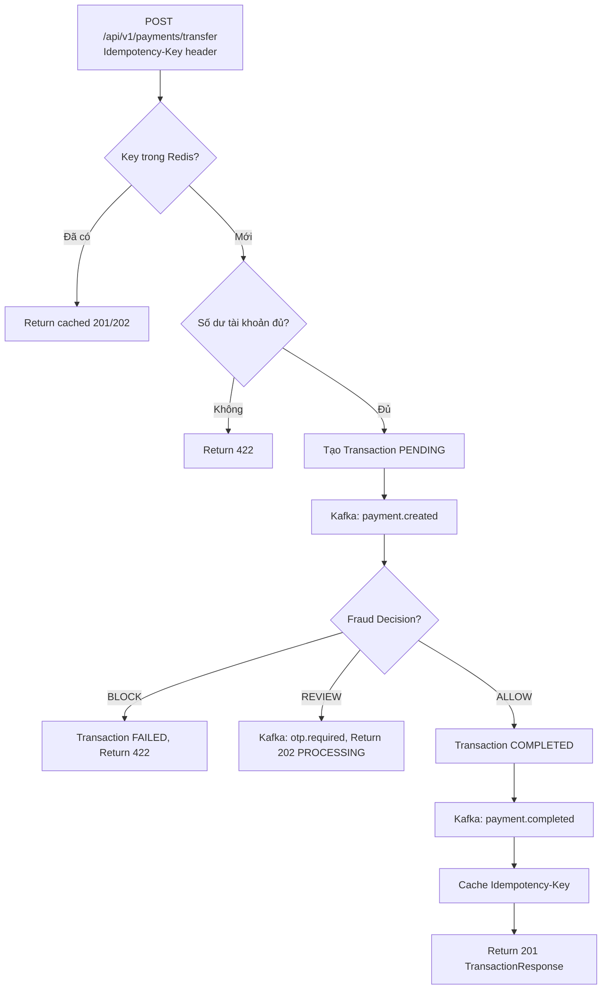
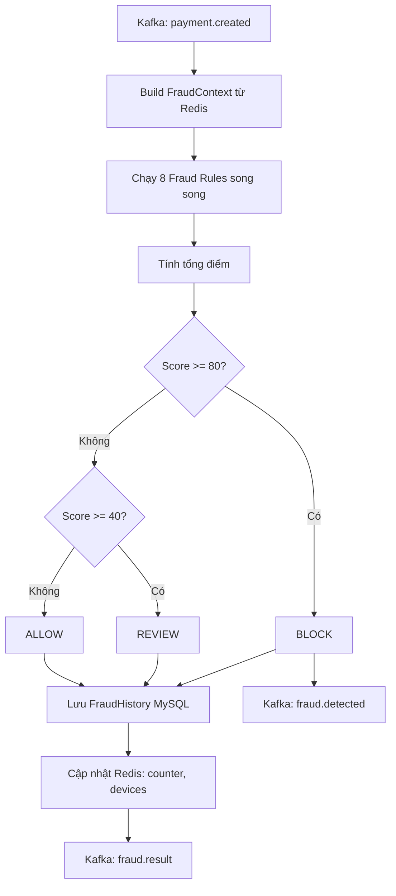
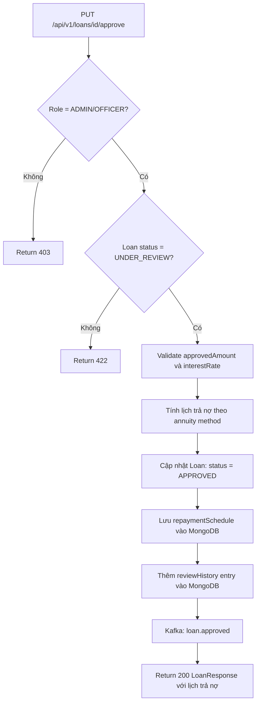

# Analysis and Design — Domain-Driven Design Approach

> **Phương pháp thay thế**: [`analysis-and-design.md`](analysis-and-design.md) (cách tiếp cận SOA/Erl).
> Tài liệu này trình bày phân tích hệ thống Finance bằng phương pháp **Strategic DDD** — xác định ranh giới service thông qua Domain Events thay vì phân rã quy trình.

**Tài liệu tham khảo:**
1. *Domain-Driven Design: Tackling Complexity in the Heart of Software* — Eric Evans
2. *Microservices Patterns: With Examples in Java* — Chris Richardson
3. *Bài tập — Phát triển phần mềm hướng dịch vụ* — Hùng Đặng (tiếng Việt)

---

## Part 1 — Domain Discovery

### 1.1 Business Process Definition

- **Domain**: Tài chính ngân hàng — Quản lý tài khoản và giao dịch cá nhân
- **Business Process**: Vòng đời quản lý tài khoản và thực hiện giao dịch tài chính (Account Lifecycle & Financial Transaction Processing)
- **Actors**:
  - *Khách hàng (Customer)*: Người dùng cuối — đăng ký tài khoản, chuyển tiền, vay vốn
  - *Nhân viên tín dụng (Credit Officer)*: Phê duyệt/từ chối đơn vay
  - *Quản trị viên (Admin)*: Giám sát, đóng băng tài khoản, xem toàn bộ giao dịch
  - *Hệ thống (System)*: Fraud detection tự động, gửi thông báo, ghi audit log
- **Phạm vi**: Quản lý tài khoản ngân hàng, chuyển tiền với kiểm tra gian lận, vay vốn có tính điểm tín dụng, thông báo sự kiện, báo cáo và kiểm toán

**Process Diagram — Vòng đời giao dịch tài chính:**

### 1.2 Existing Automation Systems

| Tên hệ thống | Loại | Vai trò hiện tại | Phương thức tích hợp |
|-------------|------|-----------------|---------------------|
| Không có | — | Chưa có hệ thống legacy | — |

> Hệ thống Finance được xây dựng greenfield — không cần Anti-Corruption Layer với hệ thống cũ.

### 1.3 Non-Functional Requirements

| Yêu cầu | Mô tả |
|---------|-------|
| **Performance** | Giao dịch chuyển tiền: < 3 giây. Fraud analysis: < 1 giây (Kafka async). Sao kê: < 500ms (MongoDB read model tối ưu). |
| **Security** | JWT HS256 (TTL 15 phút). BCrypt hashing. Rate limiting (Redis). OTP bắt buộc > 50 triệu VND. Idempotency key. |
| **Scalability** | Mỗi Bounded Context scale độc lập. Kafka partitioning. Database per Context. Payment và Fraud scale ngang dễ dàng. |
| **Availability** | Circuit Breaker (Resilience4j). Health check mọi service. Kafka at-least-once delivery. Eureka health monitoring. |
| **Auditability** | Audit Service append-only (chỉ INSERT, không UPDATE/DELETE). Toàn bộ domain events được lưu vĩnh viễn. |

---

## Part 2 — Strategic Domain-Driven Design

### 2.1 Event Storming — Domain Events

| # | Domain Event | Triggered By | Mô tả |
|---|-------------|--------------|-------|
| 1 | **AccountCreated** | Customer | Tài khoản ngân hàng mới được tạo thành công |
| 2 | **UserLoggedIn** | Customer | Người dùng đăng nhập thành công, JWT được phát hành |
| 3 | **UserLoggedOut** | Customer | Người dùng đăng xuất, JWT bị vô hiệu hóa |
| 4 | **AccountLimitUpdated** | Customer | Hạn mức giao dịch hàng ngày được cập nhật |
| 5 | **AccountFrozen** | Admin / System | Tài khoản bị đóng băng do vi phạm hoặc yêu cầu |
| 6 | **AccountUnfrozen** | Admin | Tài khoản được mở lại sau khi xác minh |
| 7 | **AccountClosed** | Customer / Admin | Tài khoản được đóng vĩnh viễn |
| 8 | **PaymentInitiated** | Customer | Lệnh chuyển tiền được khởi tạo, chờ xử lý |
| 9 | **FraudAnalysisCompleted** | Fraud System | Kết quả phân tích gian lận: ALLOW/REVIEW/BLOCK |
| 10 | **OtpRequested** | Payment System | Yêu cầu gửi OTP cho giao dịch lớn |
| 11 | **OtpVerified** | Customer | OTP được xác nhận thành công |
| 12 | **PaymentCompleted** | Payment System | Giao dịch hoàn tất, tiền đã chuyển |
| 13 | **PaymentFailed** | Payment System | Giao dịch thất bại (fraud block, lỗi hệ thống) |
| 14 | **PaymentCancelled** | Customer | Giao dịch bị hủy trước khi hoàn tất |
| 15 | **FraudDetected** | Fraud System | Phát hiện giao dịch có dấu hiệu gian lận nghiêm trọng |
| 16 | **LoanApplicationSubmitted** | Customer | Đơn vay được nộp, chờ thẩm định |
| 17 | **CreditScoreCalculated** | Loan System | Điểm tín dụng được tính toán |
| 18 | **LoanUnderReview** | Credit Officer | Đơn vay đang được nhân viên thẩm định |
| 19 | **LoanApproved** | Credit Officer | Khoản vay được phê duyệt với điều kiện cụ thể |
| 20 | **LoanRejected** | Credit Officer | Đơn vay bị từ chối |
| 21 | **NotificationSent** | Notification System | Thông báo đã được gửi thành công |
| 22 | **TransactionRecorded** | Report System | Giao dịch đã được ghi vào Read Model sao kê |
| 23 | **AuditLogCreated** | Audit System | Bản ghi kiểm toán bất biến đã được lưu |

### 2.2 Commands and Actors

| Command | Actor | Triggers Event(s) |
|---------|-------|--------------------|
| `CreateAccount` | Customer | AccountCreated |
| `Login` | Customer | UserLoggedIn |
| `Logout` | Customer | UserLoggedOut |
| `UpdateDailyLimit` | Customer | AccountLimitUpdated |
| `FreezeAccount` | Admin | AccountFrozen |
| `UnfreezeAccount` | Admin | AccountUnfrozen |
| `CloseAccount` | Customer/Admin | AccountClosed |
| `InitiateTransfer` | Customer | PaymentInitiated |
| `AnalyzeFraud` | Fraud System (auto) | FraudAnalysisCompleted, FraudDetected |
| `RequestOtp` | Payment System (auto) | OtpRequested |
| `ConfirmOtp` | Customer | OtpVerified, PaymentCompleted |
| `CancelPayment` | Customer | PaymentCancelled |
| `ApplyForLoan` | Customer | LoanApplicationSubmitted, CreditScoreCalculated |
| `ApproveLoan` | Credit Officer | LoanApproved |
| `RejectLoan` | Credit Officer | LoanRejected |
| `SendNotification` | Notification System (auto) | NotificationSent |
| `RecordTransaction` | Report System (auto) | TransactionRecorded |
| `CreateAuditLog` | Audit System (auto) | AuditLogCreated |

### 2.3 Aggregates

| Aggregate | Commands | Domain Events | Dữ liệu sở hữu |
|-----------|----------|---------------|----------------|
| **Account** | CreateAccount, Login, UpdateDailyLimit, FreezeAccount, UnfreezeAccount, CloseAccount | AccountCreated, AccountFrozen, AccountUnfrozen, AccountClosed | id, userId, accountNumber, accountType, balance, availableBalance, currency, status, dailyLimit, dailyUsed, kycStatus, fullName, email, phone |
| **AuthSession** | Login, Logout | UserLoggedIn, UserLoggedOut | accessToken, refreshToken, userId, expiresAt |
| **Transaction** | InitiateTransfer, ConfirmOtp, CancelPayment | PaymentInitiated, PaymentCompleted, PaymentFailed, PaymentCancelled | id, referenceNo, fromAccountId, toAccountId, amount, fee, currency, type, status, fraudDecision, otpVerified, idempotencyKey |
| **FraudRecord** | AnalyzeFraud | FraudAnalysisCompleted, FraudDetected | id, transactionId, userId, amount, totalScore, decision, triggeredRules |
| **Loan** | ApplyForLoan, ApproveLoan, RejectLoan | LoanApplicationSubmitted, LoanApproved, LoanRejected | id, loanCode, userId, accountId, status, loanType, requestedAmount, approvedAmount, interestRate, termMonths, creditScore, creditGrade |
| **LoanApplication** | ApplyForLoan | CreditScoreCalculated | MongoDB doc: creditScore, documents, reviewHistory, repaymentSchedule |
| **NotificationLog** | SendNotification | NotificationSent | id, userId, type, channel, recipient, subject, body, status |
| **TransactionReadModel** | RecordTransaction | TransactionRecorded | id, accountId, direction, referenceNo, amount, type, status, transactionDate |
| **AuditLog** | CreateAuditLog | AuditLogCreated | id, serviceName, action, actorId, resourceId, oldValue, newValue, timestamp |

### 2.4 Bounded Contexts

| Bounded Context | Aggregates | Trách nhiệm | Database |
|-----------------|------------|-------------|----------|
| **Identity & Account Context** | Account, AuthSession | Quản lý danh tính người dùng, tài khoản ngân hàng, xác thực JWT, KYC | MySQL (account_db), Redis |
| **Payment Context** | Transaction | Xử lý giao dịch chuyển tiền, idempotency, OTP flow, tích hợp với Fraud | MySQL (payment_db), Redis |
| **Fraud Detection Context** | FraudRecord | Phân tích rủi ro real-time bằng rule engine, duy trì feature store | MySQL (fraud_db), Redis |
| **Lending Context** | Loan, LoanApplication | Đăng ký vay, tính điểm tín dụng, thẩm định, lịch trả nợ | MySQL (loan_db), MongoDB |
| **Notification Context** | NotificationLog | Gửi email/SMS/OTP, log thông báo, quản lý template | MongoDB |
| **Reporting Context** | TransactionReadModel | CQRS Read Model — sao kê, thống kê tháng | MongoDB |
| **Audit Context** | AuditLog | Ghi log kiểm toán bất biến cho toàn hệ thống | MongoDB |

### 2.5 Context Map

**Bảng quan hệ giữa các Bounded Contexts:**

| Upstream (Provider) | Downstream (Consumer) | Kiểu quan hệ | Phương thức |
|--------------------|-----------------------|--------------|-------------|
| Identity & Account | Payment | Customer/Supplier (OHS) | REST (Feign + Circuit Breaker) |
| Payment | Fraud Detection | Published Language | Kafka: `payment.created` |
| Fraud Detection | Payment | Published Language | Kafka: `fraud.result` |
| Payment | Reporting | Published Language (CQRS) | Kafka: `payment.completed` |
| Payment | Notification | Published Language | Kafka: `payment.completed`, `notification.otp.required` |
| Payment | Audit | Published Language | Kafka: `payment.created`, `payment.completed` |
| Identity & Account | Notification | Published Language | Kafka: `account.created` |
| Identity & Account | Audit | Published Language | Kafka: `account.created`, `account.frozen` |
| Lending | Audit | Published Language | Kafka: `loan.applied`, `loan.approved` |
| Fraud Detection | Notification | Published Language | Kafka: `fraud.detected` |
| Fraud Detection | Audit | Published Language | Kafka: `fraud.detected` |

---

## Part 3 — Service-Oriented Design

### 3.1 Uniform Contract Design

**Identity & Account Context → Account Service (Port 8081):**

| Endpoint | Method | Media Type | Response Codes |
|----------|--------|------------|----------------|
| `/api/v1/auth/login` | POST | application/json | 200, 401 |
| `/api/v1/auth/logout` | POST | application/json | 200, 401 |
| `/api/v1/accounts` | GET | application/json | 200, 401 |
| `/api/v1/accounts` | POST | application/json | 201, 400, 401, 409 |
| `/api/v1/accounts/{id}` | GET | application/json | 200, 401, 404 |
| `/api/v1/accounts/me` | GET | application/json | 200, 401, 404 |
| `/api/v1/accounts/{id}/balance` | GET | application/json | 200, 401, 404 |
| `/api/v1/accounts/{id}/limits` | PUT | application/json | 200, 400, 401, 404 |
| `/api/v1/accounts/{id}/freeze` | POST | application/json | 200, 401, 404 |
| `/api/v1/accounts/{id}/unfreeze` | POST | application/json | 200, 401, 404, 422 |
| `/api/v1/accounts/{id}` | DELETE | application/json | 204, 401, 404, 422 |
| `/health` | GET | application/json | 200 |

**Payment Context → Payment Service (Port 8082):**

| Endpoint | Method | Media Type | Response Codes |
|----------|--------|------------|----------------|
| `/api/v1/payments/transfer` | POST | application/json | 201, 202, 400, 401, 409, 422 |
| `/api/v1/payments/{id}` | GET | application/json | 200, 401, 404 |
| `/api/v1/payments/history` | GET | application/json | 200, 401 |
| `/api/v1/payments/{id}/confirm` | POST | application/json | 200, 400, 401, 404, 422 |
| `/api/v1/payments/{id}/cancel` | POST | application/json | 200, 401, 404, 422 |
| `/api/v1/payments/admin/all` | GET | application/json | 200, 401, 403 |
| `/health` | GET | application/json | 200 |

**Fraud Detection Context → Fraud Service (Port 8083):**

| Endpoint | Method | Media Type | Response Codes |
|----------|--------|------------|----------------|
| `/api/v1/fraud/history` | GET | application/json | 200, 401, 403 |
| `/api/v1/fraud/history/user/{userId}` | GET | application/json | 200, 401, 404 |
| `/api/v1/fraud/history/{transactionId}` | GET | application/json | 200, 401, 404 |
| `/health` | GET | application/json | 200 |

**Lending Context → Loan Service (Port 8084):**

| Endpoint | Method | Media Type | Response Codes |
|----------|--------|------------|----------------|
| `/api/v1/loans/apply` | POST | application/json | 201, 400, 401, 422 |
| `/api/v1/loans` | GET | application/json | 200, 401 |
| `/api/v1/loans/{id}` | GET | application/json | 200, 401, 404 |
| `/api/v1/loans/{id}/approve` | PUT | application/json | 200, 401, 403, 404, 422 |
| `/api/v1/loans/{id}/reject` | PUT | application/json | 200, 401, 403, 404 |
| `/api/v1/loans/score/{userId}` | GET | application/json | 200, 401, 404 |
| `/health` | GET | application/json | 200 |

**Notification Context → Notification Service (Port 8085):**

| Endpoint | Method | Media Type | Response Codes |
|----------|--------|------------|----------------|
| `/api/v1/notifications/user/{userId}` | GET | application/json | 200, 401 |
| `/api/v1/notifications/{id}` | GET | application/json | 200, 401, 404 |
| `/health` | GET | application/json | 200 |

**Reporting Context → Report Service (Port 8086):**

| Endpoint | Method | Media Type | Response Codes |
|----------|--------|------------|----------------|
| `/api/v1/reports/statement` | GET | application/json | 200, 401 |
| `/api/v1/reports/summary/monthly` | GET | application/json | 200, 401 |
| `/health` | GET | application/json | 200 |

**Audit Context → Audit Service (Port 8087):**

| Endpoint | Method | Media Type | Response Codes |
|----------|--------|------------|----------------|
| `/api/v1/audit` | GET | application/json | 200, 401 |
| `/api/v1/audit/actor/{actorId}` | GET | application/json | 200, 401 |
| `/api/v1/audit/resource/{resourceId}` | GET | application/json | 200, 401 |
| `/api/v1/audit/service/{serviceName}` | GET | application/json | 200, 401 |
| `/health` | GET | application/json | 200 |

### 3.2 Service Logic Design

**Account Service (Identity & Account Context) — Luồng tạo tài khoản:**

**Payment Service (Payment Context) — Luồng xử lý giao dịch:**

**Fraud Service (Fraud Detection Context) — Rule Engine:**

**Loan Service (Lending Context) — Luồng phê duyệt vay:**

