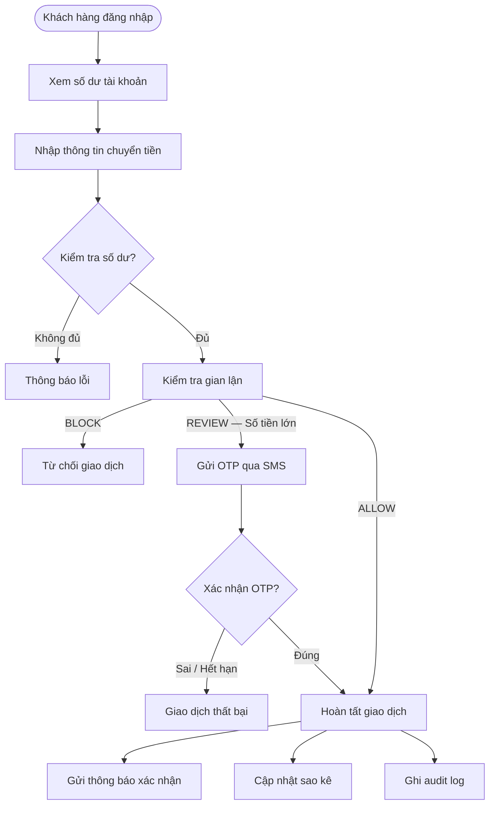
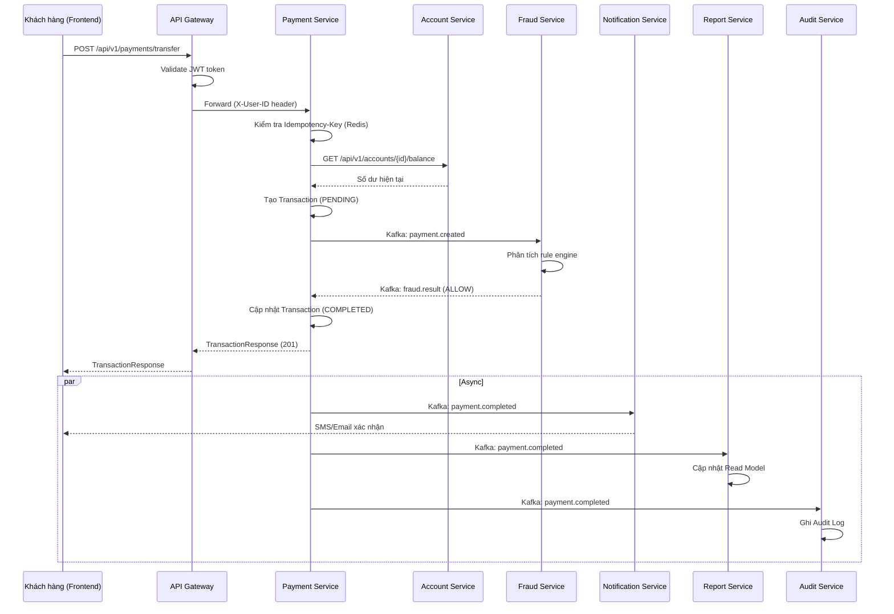
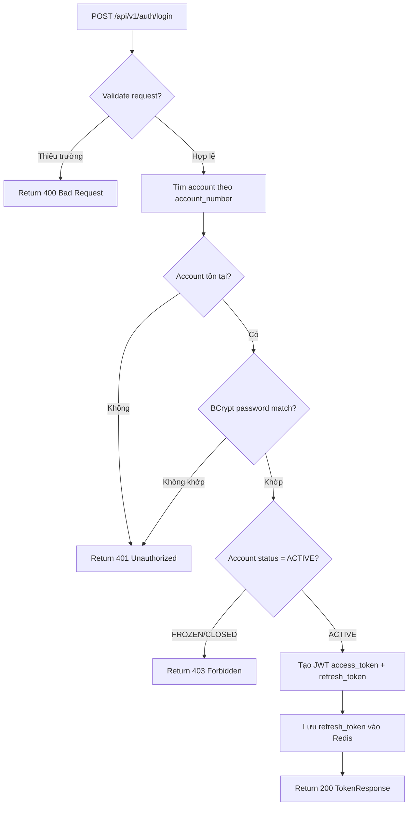
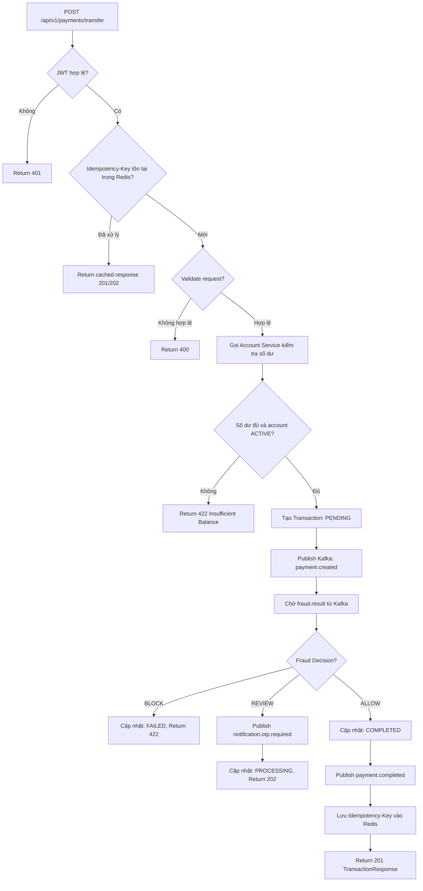
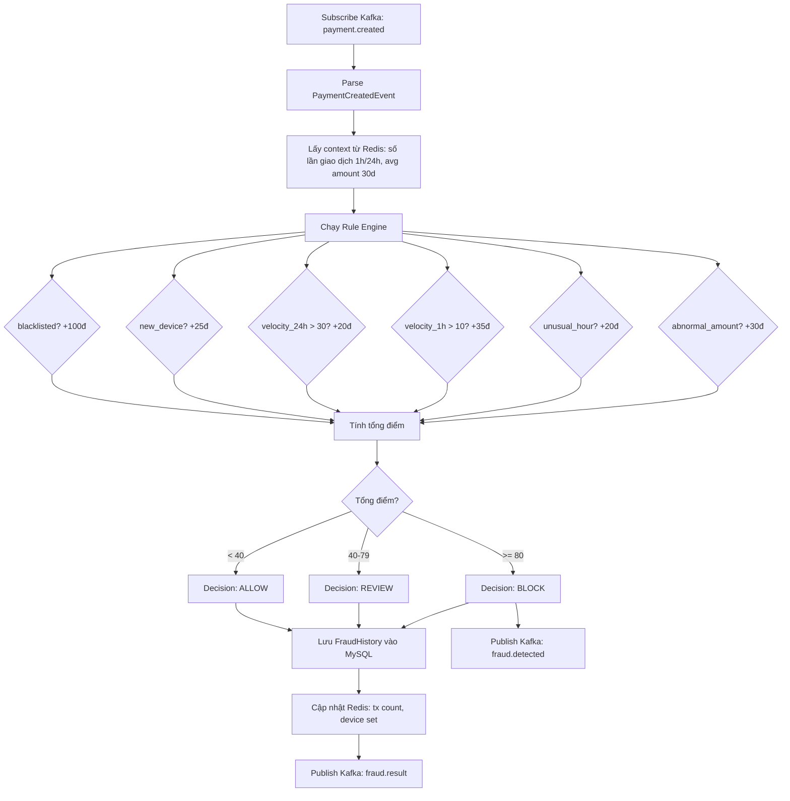
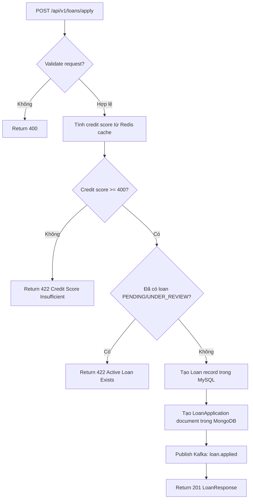

# Analysis and Design — Hệ thống Tài chính Ngân hàng

> **Mục tiêu**: Phân tích quy trình nghiệp vụ quản lý tài chính cá nhân và thiết kế giải pháp tự động hóa hướng dịch vụ (SOA/Microservices).
> Phạm vi: Hệ thống quản lý tài khoản, giao dịch chuyển tiền, phát hiện gian lận, cho vay và báo cáo tài chính.

**Tài liệu tham khảo:**
1. *Service-Oriented Architecture: Analysis and Design for Services and Microservices* — Thomas Erl (2nd Edition)
2. *Microservices Patterns: With Examples in Java* — Chris Richardson
3. *Bài tập — Phát triển phần mềm hướng dịch vụ* — Hùng Đặng (tiếng Việt)

---

## Part 1 — Analysis Preparation

### 1.1 Business Process Definition

- **Domain**: Tài chính ngân hàng — Quản lý tài khoản và giao dịch cá nhân
- **Business Process**: Quy trình chuyển tiền liên tài khoản (Inter-account Money Transfer)
- **Actors**:
  - *Khách hàng (Customer)*: Người dùng cuối thực hiện giao dịch qua web app
  - *Nhân viên tín dụng (Credit Officer)*: Phê duyệt/từ chối đơn vay
  - *Quản trị viên (Admin)*: Giám sát hệ thống, xem toàn bộ giao dịch, freeze tài khoản
  - *Hệ thống (System)*: Fraud Service tự động phân tích gian lận, Notification Service gửi thông báo
- **Phạm vi**:
  - Đăng ký / quản lý tài khoản (Account Management)
  - Xác thực và phân quyền (Authentication & Authorization)
  - Chuyển tiền với kiểm tra gian lận real-time (Payment + Fraud Detection)
  - Xác nhận OTP cho giao dịch lớn
  - Đăng ký và xét duyệt khoản vay (Loan Management)
  - Thông báo theo sự kiện (Event-driven Notification)
  - Sao kê tài khoản và báo cáo (Reporting)
  - Audit log bất biến (Compliance & Audit)

**Process Diagram — Quy trình chuyển tiền:**

### 1.2 Existing Automation Systems

| Tên hệ thống | Loại | Vai trò hiện tại | Phương thức tích hợp |
|-------------|------|-----------------|---------------------|
| Không có | — | Quy trình hiện thực hiện thủ công | — |

> Hệ thống Finance được xây dựng mới hoàn toàn — không có hệ thống legacy cần tích hợp.

### 1.3 Non-Functional Requirements

| Yêu cầu | Mô tả |
|---------|-------|
| **Performance** | API Gateway xử lý ≥ 500 req/s. Giao dịch chuyển tiền hoàn thành trong < 3 giây (không tính OTP). Kết quả fraud detection trả về trong < 1 giây qua Kafka. |
| **Security** | JWT Bearer token (HS256, TTL 15 phút). BCrypt password hashing. Rate limiting tại Gateway. OTP bắt buộc cho giao dịch > 50 triệu VND. Idempotency key chống giao dịch trùng. |
| **Scalability** | Mỗi service scale độc lập. Payment Service và Fraud Service có thể chạy nhiều instance. Kafka broker hỗ trợ partitioning. Database per Service tránh contention. |
| **Availability** | Circuit Breaker (Resilience4j) tại Gateway và Payment-Account call. Fallback khi Account Service lỗi. Health check (`GET /health`) tất cả service. Kafka đảm bảo at-least-once delivery. |
| **Auditability** | Mọi sự kiện quan trọng được ghi vào Audit Service (append-only MongoDB). Không có DELETE/UPDATE — chỉ INSERT. Traceability đầy đủ cho mục đích tuân thủ pháp lý. |
| **Consistency** | Idempotency key (Redis, TTL 24h) đảm bảo mỗi giao dịch chỉ xử lý một lần dù client retry. Optimistic locking (version field) trên Transaction entity. |

---

## Part 2 — REST/Microservices Modeling

### 2.1 Decompose Business Process & 2.2 Filter Unsuitable Actions

| # | Hành động | Actor | Mô tả | Phù hợp? |
|---|-----------|-------|-------|----------|
| 1 | Đăng ký tài khoản | Khách hàng | Tạo tài khoản ngân hàng mới với thông tin KYC | ✅ |
| 2 | Đăng nhập / Xác thực | Khách hàng | Đăng nhập bằng số tài khoản + mật khẩu, nhận JWT | ✅ |
| 3 | Xem số dư tài khoản | Khách hàng | Truy vấn số dư hiện tại và số dư khả dụng | ✅ |
| 4 | Cập nhật hạn mức giao dịch | Khách hàng | Thay đổi hạn mức chuyển tiền hàng ngày | ✅ |
| 5 | Khởi tạo giao dịch chuyển tiền | Khách hàng | Nhập thông tin người nhận và số tiền | ✅ |
| 6 | Kiểm tra số dư và hạn mức | Hệ thống | Xác nhận số dư đủ và chưa vượt hạn mức ngày | ✅ |
| 7 | Phân tích rủi ro gian lận | Hệ thống | Chấm điểm giao dịch theo rule engine | ✅ |
| 8 | Gửi OTP | Hệ thống | Gửi mã OTP qua SMS cho giao dịch lớn | ✅ |
| 9 | Xác nhận OTP | Khách hàng | Nhập mã OTP nhận được qua SMS | ✅ |
| 10 | Thực hiện chuyển tiền | Hệ thống | Trừ tiền bên gửi, cộng tiền bên nhận | ✅ |
| 11 | Gửi thông báo xác nhận | Hệ thống | Gửi email/SMS xác nhận giao dịch thành công | ✅ |
| 12 | Cập nhật sao kê | Hệ thống | Ghi nhận giao dịch vào sao kê của cả 2 tài khoản | ✅ |
| 13 | Ghi audit log | Hệ thống | Lưu log bất biến vào hệ thống kiểm toán | ✅ |
| 14 | Đóng băng tài khoản | Admin | Khóa tài khoản nghi ngờ gian lận | ✅ |
| 15 | Nộp đơn vay | Khách hàng | Điền thông tin đơn vay, tải tài liệu | ✅ |
| 16 | Tính điểm tín dụng | Hệ thống | Tính toán credit score tự động | ✅ |
| 17 | Thẩm định đơn vay | Nhân viên tín dụng | Xem xét hồ sơ và quyết định phê duyệt/từ chối | ✅ |
| 18 | Tạo lịch trả nợ | Hệ thống | Tính toán lịch trả nợ theo lãi suất | ✅ |
| 19 | Đàm phán điều khoản | Nhân viên tín dụng | Thương lượng trực tiếp với khách hàng | ❌ (thủ công) |
| 20 | Phán quyết pháp lý | Luật sư | Quyết định pháp lý liên quan đến tranh chấp | ❌ (không tự động hóa) |

### 2.3 Entity Service Candidates

| Entity | Service Candidate | Agnostic Actions (tái sử dụng) |
|--------|-------------------|-------------------------------|
| Account | **Account Service** | Tạo tài khoản, lấy thông tin tài khoản, kiểm tra số dư, cập nhật hạn mức, đóng băng/mở tài khoản, xác thực người dùng (login/logout) |
| Transaction | **Payment Service** | Tạo giao dịch, lấy giao dịch theo ID, lấy lịch sử giao dịch, hủy giao dịch |
| FraudRecord | **Fraud Service** | Phân tích giao dịch, lấy lịch sử phân tích theo user/transaction |
| Loan | **Loan Service** | Nộp đơn vay, lấy thông tin khoản vay, lấy danh sách khoản vay, phê duyệt/từ chối, tính credit score |
| Notification | **Notification Service** | Gửi thông báo, lấy lịch sử thông báo theo user/trạng thái |
| TransactionReadModel | **Report Service** | Lấy sao kê tài khoản, thống kê giao dịch theo tháng |
| AuditLog | **Audit Service** | Ghi log, tra cứu log theo actor/resource/service |

### 2.4 Task Service Candidate

| Non-agnostic Action | Task Service Candidate | Ghi chú |
|---------------------|------------------------|---------|
| Kiểm tra fraud → quyết định OTP hoặc ALLOW | **Payment Service** | Orchestrate: khởi tạo transaction → publish event → nhận fraud.result → quyết định flow tiếp theo |
| Tính credit score → quyết định duyệt vay | **Loan Service** | Orchestrate: tính điểm → tạo lịch trả nợ → gửi event |
| Xác thực OTP → hoàn tất giao dịch | **Payment Service** | Kiểm tra OTP trong Redis, cập nhật trạng thái COMPLETED |

### 2.5 Identify Resources

| Entity / Quy trình | Resource URI |
|-------------------|--------------|
| Xác thực (login/logout) | `/api/v1/auth/login`, `/api/v1/auth/logout` |
| Tài khoản | `/api/v1/accounts`, `/api/v1/accounts/{id}`, `/api/v1/accounts/me` |
| Số dư tài khoản | `/api/v1/accounts/{id}/balance` |
| Hạn mức giao dịch | `/api/v1/accounts/{id}/limits` |
| Đóng băng/mở tài khoản | `/api/v1/accounts/{id}/freeze`, `/api/v1/accounts/{id}/unfreeze` |
| Giao dịch chuyển tiền | `/api/v1/payments/transfer` |
| Chi tiết giao dịch | `/api/v1/payments/{id}` |
| Lịch sử giao dịch | `/api/v1/payments/history` |
| Xác nhận OTP | `/api/v1/payments/{id}/confirm` |
| Hủy giao dịch | `/api/v1/payments/{id}/cancel` |
| Lịch sử gian lận | `/api/v1/fraud/history`, `/api/v1/fraud/history/user/{userId}`, `/api/v1/fraud/history/{transactionId}` |
| Đơn vay | `/api/v1/loans`, `/api/v1/loans/apply`, `/api/v1/loans/{id}` |
| Phê duyệt/từ chối vay | `/api/v1/loans/{id}/approve`, `/api/v1/loans/{id}/reject` |
| Điểm tín dụng | `/api/v1/loans/score/{userId}` |
| Thông báo | `/api/v1/notifications/user/{userId}`, `/api/v1/notifications/{id}` |
| Sao kê tài khoản | `/api/v1/reports/statement` |
| Thống kê tháng | `/api/v1/reports/summary/monthly` |
| Audit log | `/api/v1/audit`, `/api/v1/audit/actor/{actorId}`, `/api/v1/audit/resource/{resourceId}` |

### 2.6 Associate Capabilities with Resources and Methods

| Service Candidate | Capability | Resource | HTTP Method |
|-------------------|------------|----------|-------------|
| Account Service | Đăng nhập | `/api/v1/auth/login` | POST |
| Account Service | Đăng xuất | `/api/v1/auth/logout` | POST |
| Account Service | Tạo tài khoản | `/api/v1/accounts` | POST |
| Account Service | Lấy danh sách tài khoản | `/api/v1/accounts` | GET |
| Account Service | Lấy tài khoản theo ID | `/api/v1/accounts/{id}` | GET |
| Account Service | Lấy tài khoản của tôi | `/api/v1/accounts/me` | GET |
| Account Service | Lấy số dư | `/api/v1/accounts/{id}/balance` | GET |
| Account Service | Cập nhật hạn mức | `/api/v1/accounts/{id}/limits` | PUT |
| Account Service | Đóng băng tài khoản | `/api/v1/accounts/{id}/freeze` | POST |
| Account Service | Mở đóng băng | `/api/v1/accounts/{id}/unfreeze` | POST |
| Account Service | Đóng tài khoản | `/api/v1/accounts/{id}` | DELETE |
| Payment Service | Chuyển tiền | `/api/v1/payments/transfer` | POST |
| Payment Service | Chi tiết giao dịch | `/api/v1/payments/{id}` | GET |
| Payment Service | Lịch sử giao dịch | `/api/v1/payments/history` | GET |
| Payment Service | Xác nhận OTP | `/api/v1/payments/{id}/confirm` | POST |
| Payment Service | Hủy giao dịch | `/api/v1/payments/{id}/cancel` | POST |
| Payment Service | Xem tất cả giao dịch (Admin) | `/api/v1/payments/admin/all` | GET |
| Fraud Service | Lịch sử gian lận | `/api/v1/fraud/history` | GET |
| Fraud Service | Gian lận theo user | `/api/v1/fraud/history/user/{userId}` | GET |
| Fraud Service | Gian lận theo giao dịch | `/api/v1/fraud/history/{transactionId}` | GET |
| Loan Service | Nộp đơn vay | `/api/v1/loans/apply` | POST |
| Loan Service | Danh sách khoản vay | `/api/v1/loans` | GET |
| Loan Service | Chi tiết khoản vay | `/api/v1/loans/{id}` | GET |
| Loan Service | Phê duyệt vay | `/api/v1/loans/{id}/approve` | PUT |
| Loan Service | Từ chối vay | `/api/v1/loans/{id}/reject` | PUT |
| Loan Service | Điểm tín dụng | `/api/v1/loans/score/{userId}` | GET |
| Notification Service | Thông báo theo user | `/api/v1/notifications/user/{userId}` | GET |
| Notification Service | Chi tiết thông báo | `/api/v1/notifications/{id}` | GET |
| Report Service | Sao kê tài khoản | `/api/v1/reports/statement` | GET |
| Report Service | Thống kê tháng | `/api/v1/reports/summary/monthly` | GET |
| Audit Service | Toàn bộ audit log | `/api/v1/audit` | GET |
| Audit Service | Log theo actor | `/api/v1/audit/actor/{actorId}` | GET |
| Audit Service | Log theo resource | `/api/v1/audit/resource/{resourceId}` | GET |

### 2.7 Utility Service & Microservice Candidates

| Candidate | Loại | Lý do |
|-----------|------|-------|
| **API Gateway** | Utility | Cross-cutting concern: xác thực JWT, rate limiting, routing, CORS, circuit breaker cho toàn bộ hệ thống |
| **Eureka Server** | Utility | Service discovery và health monitoring — cần thiết khi nhiều service instance chạy song song |
| **Fraud Service** | Microservice | Yêu cầu xử lý nhanh (< 1s) và hoàn toàn độc lập. Rule engine phức tạp, cần scale riêng khi lượng giao dịch tăng |
| **Notification Service** | Utility | Cross-cutting: nhiều service cần gửi thông báo. Tách biệt logic gửi email/SMS ra khỏi nghiệp vụ chính |
| **Report Service** | Microservice | CQRS Read Model — tách biệt hoàn toàn write side. Tối ưu cho query phức tạp mà không ảnh hưởng Payment Service |
| **Audit Service** | Utility | Cross-cutting compliance: ghi log cho mọi sự kiện trong hệ thống. Append-only để đảm bảo tính bất biến |

### 2.8 Service Composition Candidates — Quy trình chuyển tiền

---

## Part 3 — Service-Oriented Design

### 3.1 Uniform Contract Design

**Account Service (Port 8081):**

| Endpoint | Method | Media Type | Response Codes |
|----------|--------|------------|----------------|
| `/api/v1/auth/login` | POST | application/json | 200, 401 |
| `/api/v1/auth/logout` | POST | application/json | 200, 401 |
| `/api/v1/accounts` | GET | application/json | 200, 401 |
| `/api/v1/accounts` | POST | application/json | 201, 400, 401, 409 |
| `/api/v1/accounts/{id}` | GET | application/json | 200, 401, 404 |
| `/api/v1/accounts/me` | GET | application/json | 200, 401, 404 |
| `/api/v1/accounts/{id}/balance` | GET | application/json | 200, 401, 404 |
| `/api/v1/accounts/{id}/limits` | PUT | application/json | 200, 400, 401, 404 |
| `/api/v1/accounts/{id}/freeze` | POST | application/json | 200, 401, 404 |
| `/api/v1/accounts/{id}/unfreeze` | POST | application/json | 200, 401, 404, 422 |
| `/api/v1/accounts/{id}` | DELETE | application/json | 204, 401, 404, 422 |
| `/health` | GET | application/json | 200 |

**Payment Service (Port 8082):**

| Endpoint | Method | Media Type | Response Codes |
|----------|--------|------------|----------------|
| `/api/v1/payments/transfer` | POST | application/json | 201, 202, 400, 401, 409, 422 |
| `/api/v1/payments/{id}` | GET | application/json | 200, 401, 404 |
| `/api/v1/payments/history` | GET | application/json | 200, 401 |
| `/api/v1/payments/{id}/confirm` | POST | application/json | 200, 400, 401, 404, 422 |
| `/api/v1/payments/{id}/cancel` | POST | application/json | 200, 401, 404, 422 |
| `/api/v1/payments/admin/all` | GET | application/json | 200, 401, 403 |
| `/health` | GET | application/json | 200 |

**Fraud Service (Port 8083):**

| Endpoint | Method | Media Type | Response Codes |
|----------|--------|------------|----------------|
| `/api/v1/fraud/history` | GET | application/json | 200, 401, 403 |
| `/api/v1/fraud/history/user/{userId}` | GET | application/json | 200, 401, 404 |
| `/api/v1/fraud/history/{transactionId}` | GET | application/json | 200, 401, 404 |
| `/health` | GET | application/json | 200 |

**Loan Service (Port 8084):**

| Endpoint | Method | Media Type | Response Codes |
|----------|--------|------------|----------------|
| `/api/v1/loans/apply` | POST | application/json | 201, 400, 401, 422 |
| `/api/v1/loans` | GET | application/json | 200, 401 |
| `/api/v1/loans/{id}` | GET | application/json | 200, 401, 404 |
| `/api/v1/loans/{id}/approve` | PUT | application/json | 200, 401, 403, 404, 422 |
| `/api/v1/loans/{id}/reject` | PUT | application/json | 200, 401, 403, 404 |
| `/api/v1/loans/score/{userId}` | GET | application/json | 200, 401, 404 |
| `/health` | GET | application/json | 200 |

**Notification Service (Port 8085):**

| Endpoint | Method | Media Type | Response Codes |
|----------|--------|------------|----------------|
| `/api/v1/notifications/user/{userId}` | GET | application/json | 200, 401 |
| `/api/v1/notifications/{id}` | GET | application/json | 200, 401, 404 |
| `/health` | GET | application/json | 200 |

**Report Service (Port 8086):**

| Endpoint | Method | Media Type | Response Codes |
|----------|--------|------------|----------------|
| `/api/v1/reports/statement` | GET | application/json | 200, 401 |
| `/api/v1/reports/summary/monthly` | GET | application/json | 200, 401 |
| `/health` | GET | application/json | 200 |

**Audit Service (Port 8087):**

| Endpoint | Method | Media Type | Response Codes |
|----------|--------|------------|----------------|
| `/api/v1/audit` | GET | application/json | 200, 401 |
| `/api/v1/audit/actor/{actorId}` | GET | application/json | 200, 401 |
| `/api/v1/audit/resource/{resourceId}` | GET | application/json | 200, 401 |
| `/api/v1/audit/service/{serviceName}` | GET | application/json | 200, 401 |
| `/health` | GET | application/json | 200 |

### 3.2 Service Logic Design

**Account Service — Luồng xử lý đăng nhập:**

**Payment Service — Luồng xử lý chuyển tiền:**

**Fraud Service — Luồng phân tích gian lận:**

**Loan Service — Luồng nộp đơn vay:**

