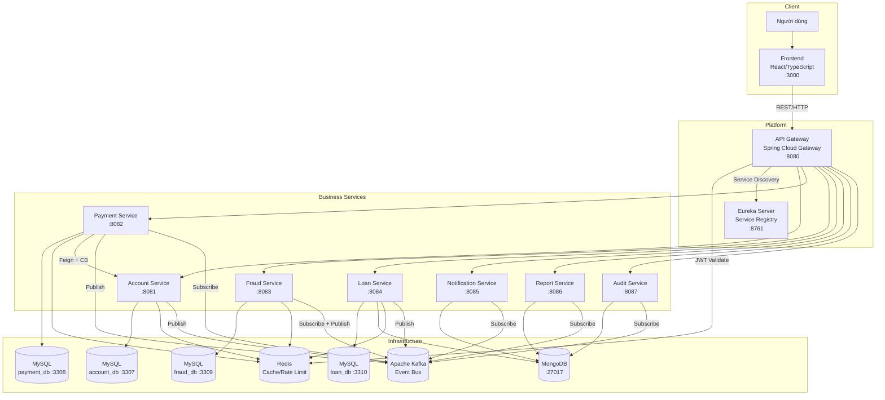
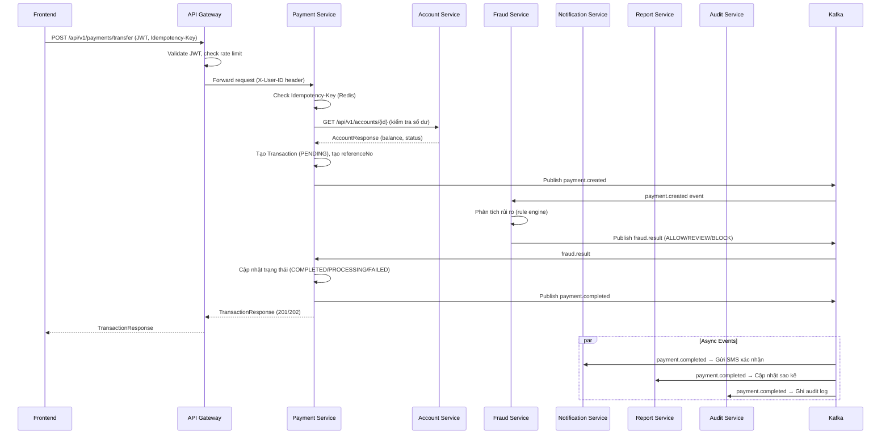
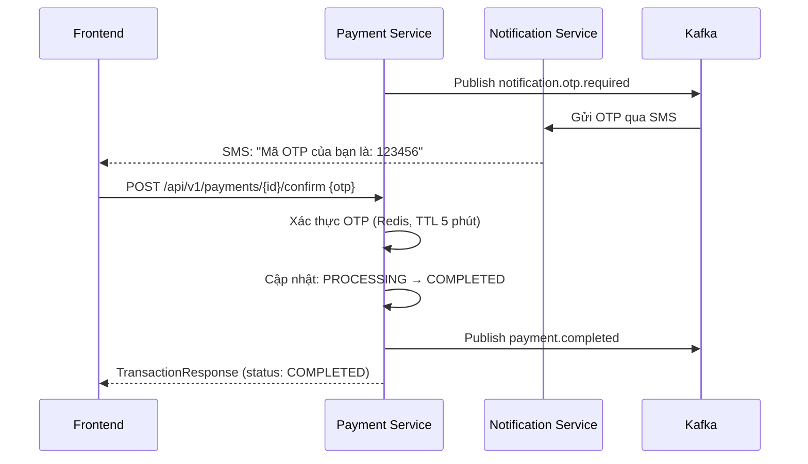

# System Architecture — Finance Microservices Platform

> Tài liệu này được hoàn thành sau khi phân tích nghiệp vụ trong [Analysis and Design](analysis-and-design.md).
> Dựa trên các Service Candidates và Non-Functional Requirements đã xác định, nhóm lựa chọn các kiến trúc pattern phù hợp và thiết kế kiến trúc triển khai.

**Tài liệu tham khảo:**
1. *Service-Oriented Architecture: Analysis and Design for Services and Microservices* — Thomas Erl (2nd Edition)
2. *Microservices Patterns: With Examples in Java* — Chris Richardson
3. *Bài tập — Phát triển phần mềm hướng dịch vụ* — Hùng Đặng (tiếng Việt)

---

## 1. Pattern Selection

| Pattern | Áp dụng? | Lý do kỹ thuật / nghiệp vụ |
|---------|----------|----------------------------|
| **API Gateway** | ✅ | Cổng duy nhất cho toàn bộ client. Xác thực JWT tập trung, rate limiting, routing theo path. Frontend chỉ cần biết một địa chỉ duy nhất là `http://localhost:8080`. |
| **Database per Service** | ✅ | Mỗi service nghiệp vụ có database riêng biệt hoàn toàn — tránh coupling và cho phép scale độc lập. Account dùng MySQL, Notification/Report/Audit dùng MongoDB. |
| **Shared Database** | ❌ | Không áp dụng — vi phạm nguyên tắc autonomy của microservices. |
| **Saga** | ❌ | Chưa triển khai — giao dịch phân tán được xử lý qua Kafka events và trạng thái PROCESSING/COMPLETED trên Payment Service. |
| **Event-Driven / Message Queue** | ✅ | Apache Kafka dùng cho giao tiếp bất đồng bộ giữa các service (Payment → Fraud, Payment → Notification, Payment → Report, Payment → Audit). Tách coupling, đảm bảo fault tolerance. |
| **CQRS** | ✅ | Report Service xây dựng Read Model riêng từ Kafka events `payment.completed`. Tách biệt hoàn toàn write side (Payment) và read side (Report) để tối ưu query. |
| **Circuit Breaker** | ✅ | Resilience4j áp dụng trên API Gateway và Payment Service (OpenFeign → Account Service). Khi Account Service lỗi, fallback trả về lỗi 503 thay vì cascade failure. |
| **Service Registry / Discovery** | ✅ | Spring Cloud Netflix Eureka. Tất cả service đăng ký khi khởi động. API Gateway load balance qua Eureka thay vì hardcode địa chỉ IP. |
| **Rate Limiting** | ✅ | Redis-based rate limiting tại API Gateway: 60 req/s cho account endpoints, 30 req/s cho payment endpoints. Chống DDoS và abuse. |
| **Idempotency** | ✅ | Header `Idempotency-Key` bắt buộc cho POST /payments/transfer. Redis lưu key trong 24h. Ngăn giao dịch trùng khi client retry. |

---

## 2. System Components

| Component | Trách nhiệm | Tech Stack | Port |
|-----------|-------------|------------|------|
| **Frontend** | Giao diện người dùng: đăng nhập, xem tài khoản, chuyển tiền, xem lịch sử, quản lý vay | React 18, TypeScript, Vite, TailwindCSS, Zustand, Axios | 3000 |
| **API Gateway** | Cổng vào duy nhất: JWT validation, routing, rate limiting, circuit breaker, CORS | Spring Cloud Gateway (reactive), Resilience4j, Redis | 8080 |
| **Eureka Server** | Service registry & discovery: đăng ký service, health monitoring, load balancing | Spring Cloud Netflix Eureka Server | 8761 |
| **Account Service** | Quản lý tài khoản, KYC, xác thực (login/logout), đóng băng/mở tài khoản | Spring Boot 3.2, Spring Security, MySQL, Redis, Kafka, JWT | 8081 |
| **Payment Service** | Xử lý giao dịch chuyển tiền, OTP, lịch sử giao dịch | Spring Boot 3.2, MySQL, Redis, Kafka, OpenFeign, Resilience4j | 8082 |
| **Fraud Service** | Phát hiện gian lận bằng rule engine, phân tích rủi ro theo real-time | Spring Boot 3.2, MySQL, Redis, Kafka | 8083 |
| **Loan Service** | Đăng ký vay, tính điểm tín dụng, phê duyệt, lịch trả nợ | Spring Boot 3.2, MySQL, MongoDB, Redis, Kafka | 8084 |
| **Notification Service** | Gửi email/SMS/OTP khi có sự kiện quan trọng | Spring Boot 3.2, MongoDB, Kafka, JavaMail | 8085 |
| **Report Service** | CQRS Read Model — sao kê tài khoản, thống kê giao dịch | Spring Boot 3.2, MongoDB, Kafka | 8086 |
| **Audit Service** | Ghi log kiểm toán bất biến (append-only) cho mọi sự kiện | Spring Boot 3.2, MongoDB, Kafka | 8087 |
| **MySQL (account)** | Database quan hệ cho Account Service | MySQL 8.0 | 3307 |
| **MySQL (payment)** | Database quan hệ cho Payment Service | MySQL 8.0 | 3308 |
| **MySQL (fraud)** | Database quan hệ cho Fraud Service | MySQL 8.0 | 3309 |
| **MySQL (loan)** | Database quan hệ cho Loan Service | MySQL 8.0 | 3310 |
| **MongoDB** | Database NoSQL dùng chung cho Loan, Notification, Report, Audit | MongoDB 7.0 | 27017 |
| **Redis** | Cache đa mục đích: JWT token, idempotency key, OTP, fraud feature store, credit score | Redis 7.2 | 6380 |
| **Apache Kafka** | Event streaming broker: giao tiếp bất đồng bộ giữa các service | Confluent Kafka 7.6 + Zookeeper | 9092 (Docker nội bộ) / 9093 (host) |

---

## 3. Communication

### 3.1 Inter-service Communication Matrix

| From → To | Account | Payment | Fraud | Loan | Notification | Report | Audit | Gateway | Database |
|-----------|---------|---------|-------|------|--------------|--------|-------|---------|----------|
| **Frontend** | — | — | — | — | — | — | — | REST/HTTP | — |
| **Gateway** | HTTP Proxy | HTTP Proxy | HTTP Proxy | HTTP Proxy | HTTP Proxy | HTTP Proxy | HTTP Proxy | — | — |
| **Account** | — | — | — | — | Kafka: `account.created` | — | Kafka: `account.created`, `account.frozen` | Eureka | MySQL (3307), Redis |
| **Payment** | REST (Feign + Circuit Breaker) | — | Kafka: `payment.created` → nhận `fraud.result` | — | Kafka: `payment.completed`, `notification.otp.required` | Kafka: `payment.completed` | Kafka: `payment.created`, `payment.completed` | Eureka | MySQL (3308), Redis |
| **Fraud** | — | Kafka: `fraud.result` | — | — | Kafka: `fraud.detected` | — | Kafka: `fraud.detected` | Eureka | MySQL (3309), Redis |
| **Loan** | — | — | — | — | — | — | Kafka: `loan.applied`, `loan.approved` | Eureka | MySQL (3310), MongoDB |
| **Notification** | — | — | — | — | — | — | — | Eureka | MongoDB |
| **Report** | — | — | — | — | — | — | — | Eureka | MongoDB |
| **Audit** | — | — | — | — | — | — | — | Eureka | MongoDB |

### 3.2 Kafka Topic Map

| Topic | Producer | Consumer(s) | Mô tả |
|-------|----------|-------------|-------|
| `payment.created` | Payment Service | Fraud Service, Audit Service | Giao dịch vừa được khởi tạo, chờ kiểm tra gian lận |
| `payment.completed` | Payment Service | Notification Service, Report Service, Audit Service | Giao dịch hoàn thành thành công |
| `payment.failed` | Payment Service | Audit Service | Giao dịch thất bại |
| `fraud.result` | Fraud Service | Payment Service | Kết quả phân tích gian lận (ALLOW/REVIEW/BLOCK) |
| `fraud.detected` | Fraud Service | Notification Service, Audit Service | Phát hiện giao dịch gian lận |
| `notification.otp.required` | Payment Service | Notification Service | Yêu cầu gửi OTP cho giao dịch lớn |
| `account.created` | Account Service | Notification Service, Audit Service | Tài khoản mới được tạo |
| `account.frozen` | Account Service | Audit Service | Tài khoản bị đóng băng |
| `loan.applied` | Loan Service | Audit Service | Đơn vay mới được nộp |
| `loan.approved` | Loan Service | Audit Service | Khoản vay được phê duyệt |

### 3.3 Routing Table (API Gateway)

| External Path | Service Đích | Yêu cầu Auth | Rate Limit |
|---------------|--------------|--------------|------------|
| `POST /api/v1/auth/**` | account-service | Không | — |
| `GET/PUT /api/v1/accounts/**` | account-service | Có (JWT) | 60 req/s |
| `POST /api/v1/payments/**` | payment-service | Có (JWT) | 30 req/s |
| `GET /api/v1/payments/**` | payment-service | Có (JWT) | 60 req/s |
| `GET/POST /api/v1/fraud/**` | fraud-service | Có (JWT) | 30 req/s |
| `GET/POST /api/v1/loans/**` | loan-service | Có (JWT) | 30 req/s |
| `GET /api/v1/reports/**` | report-service | Có (JWT) | 60 req/s |
| `GET /api/v1/notifications/**` | notification-service | Có (JWT) | 60 req/s |
| `GET /api/v1/audit/**` | audit-service | Có (JWT) | 30 req/s |

---

## 4. Architecture Diagram

### 4.1 Sơ đồ tổng quan hệ thống



### 4.2 Luồng xử lý giao dịch chuyển tiền (Happy Path)



### 4.3 Luồng xử lý OTP (Giao dịch > 50 triệu VND)



---

## 5. Deployment

- Tất cả service được containerize bằng Docker (mỗi service có Dockerfile riêng)
- Orchestration bằng Docker Compose duy nhất tại root project
- Lệnh khởi chạy toàn bộ hệ thống: `docker compose up --build`
- Network nội bộ: `finance-network` (bridge) — service giao tiếp qua tên service (DNS), không dùng `localhost`
- Volumes persist: dữ liệu MySQL, MongoDB, Redis, Kafka được giữ lại giữa các lần restart

### Ghi chú về Kafka Port

| Phạm vi | Địa chỉ | Dùng bởi |
|---------|---------|---------|
| Nội bộ Docker (PLAINTEXT) | `finance-kafka:9092` | Tất cả microservices (`KAFKA_SERVERS` env var) |
| Bên ngoài host (PLAINTEXT_HOST) | `localhost:9093` | Dev tool, Kafka UI, test local |

### Thứ tự khởi động (dependency chain)

```
Zookeeper → Kafka
MySQL (x4) ┐
MongoDB    ├→ Eureka Server → API Gateway → Business Services → Frontend
Redis      ┘
```

### Biến môi trường (.env)

| Biến | Mô tả | Giá trị mặc định |
|------|-------|-----------------|
| `DB_USERNAME` | Username MySQL | root |
| `DB_PASSWORD` | Mật khẩu MySQL | root |
| `MONGO_USERNAME` | Username MongoDB | admin |
| `MONGO_PASSWORD` | Mật khẩu MongoDB | admin123 |
| `EUREKA_USERNAME` | Username Eureka | admin |
| `EUREKA_PASSWORD` | Mật khẩu Eureka | admin123 |
| `JWT_SECRET` | Khóa ký JWT (≥256 bit) | finance-secret-key-... |
| `MAIL_HOST` | SMTP server | smtp.gmail.com |
| `MAIL_USERNAME` | Email gửi thông báo | — |
| `MAIL_PASSWORD` | App password email | — |
