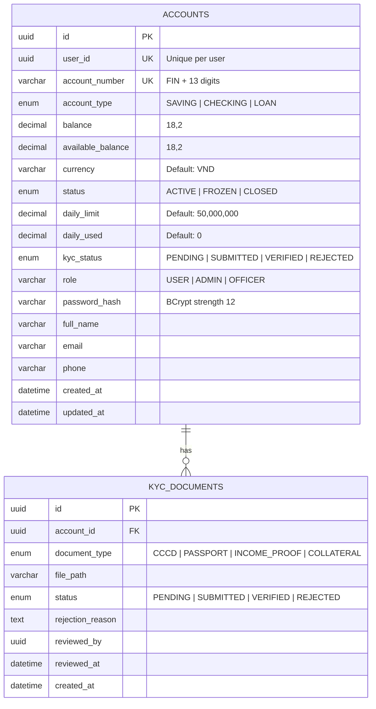
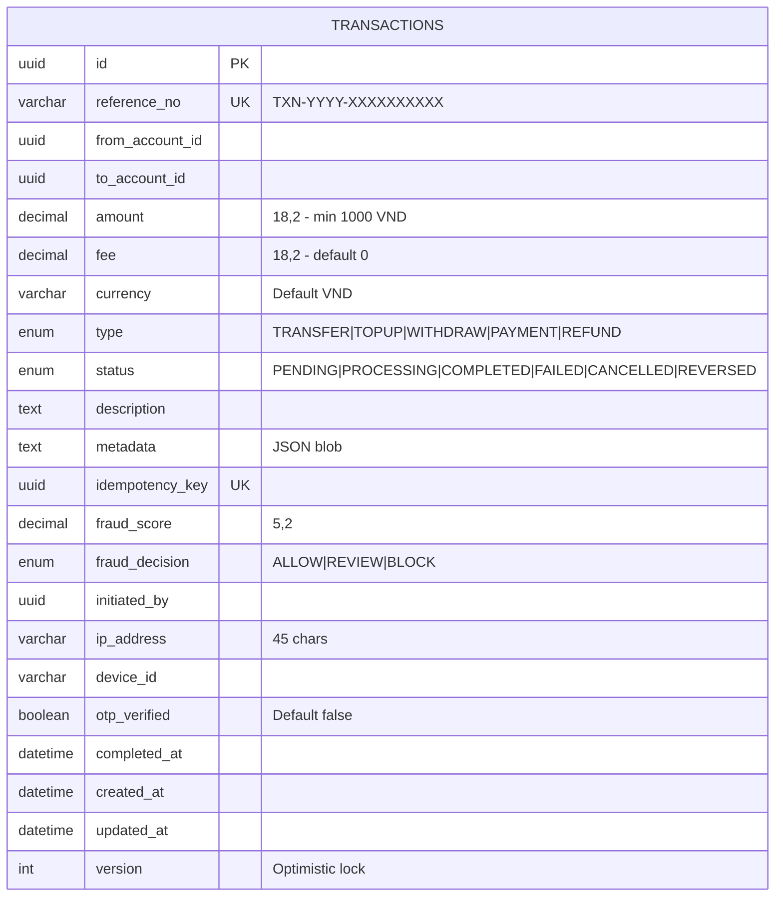
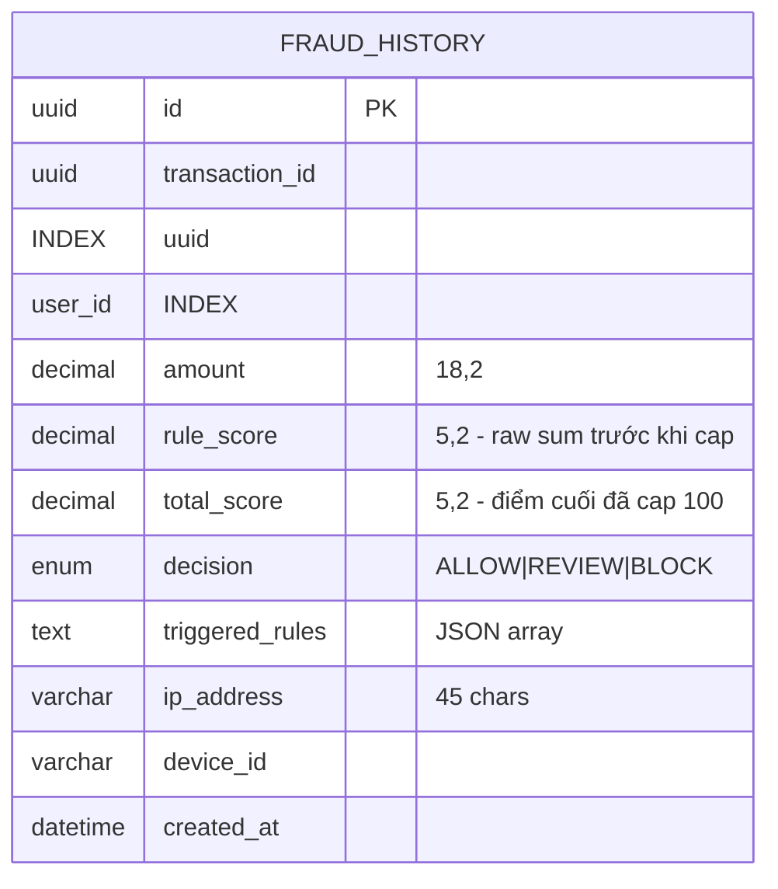

# Data Model — Finance Microservices Platform

Tài liệu mô tả schema cơ sở dữ liệu của từng service. Mỗi service sử dụng database riêng biệt hoàn toàn (Database per Service pattern).

---

## Tổng quan Database

| Service | Database | Công nghệ | Port |
|---------|----------|-----------|------|
| Account Service | `account_db` | MySQL 8.0 | 3307 |
| Payment Service | `payment_db` | MySQL 8.0 | 3308 |
| Fraud Service | `fraud_db` | MySQL 8.0 | 3309 |
| Loan Service | `loan_db` | MySQL 8.0 + MongoDB | 3310 / 27017 |
| Notification Service | `notification_db` | MongoDB 7.0 | 27017 |
| Report Service | `report_db` | MongoDB 7.0 | 27017 |
| Audit Service | `audit_db` | MongoDB 7.0 | 27017 |

---

## 1. Account Service — MySQL `account_db`

### ERD



### Bảng `accounts`

| Column | Type | Constraint | Mô tả |
|--------|------|-----------|-------|
| `id` | UUID | PK | Định danh tài khoản |
| `user_id` | UUID | UNIQUE | Định danh người dùng |
| `account_number` | VARCHAR(20) | UNIQUE | Format: FIN + 13 chữ số |
| `account_type` | ENUM | NOT NULL | SAVING / CHECKING / LOAN |
| `balance` | DECIMAL(18,2) | DEFAULT 0 | Tổng số dư |
| `available_balance` | DECIMAL(18,2) | DEFAULT 0 | Số dư khả dụng |
| `currency` | VARCHAR(3) | DEFAULT 'VND' | Đơn vị tiền tệ |
| `status` | ENUM | DEFAULT 'ACTIVE' | ACTIVE / FROZEN / CLOSED |
| `daily_limit` | DECIMAL(18,2) | DEFAULT 50000000 | Hạn mức chuyển tiền/ngày |
| `daily_used` | DECIMAL(18,2) | DEFAULT 0 | Đã dùng trong ngày |
| `kyc_status` | ENUM | DEFAULT 'PENDING' | Trạng thái xác minh KYC |
| `role` | VARCHAR(20) | DEFAULT 'USER' | Phân quyền |
| `password_hash` | VARCHAR(255) | NOT NULL | BCrypt |
| `full_name` | VARCHAR(100) | NOT NULL | Họ và tên |
| `email` | VARCHAR(255) | | Email |
| `phone` | VARCHAR(20) | | Số điện thoại |
| `created_at` | DATETIME | | Thời điểm tạo |
| `updated_at` | DATETIME | | Thời điểm cập nhật |

**Indexes:** `user_id`, `account_number`, `status`

### Bảng `kyc_documents`

| Column | Type | Constraint | Mô tả |
|--------|------|-----------|-------|
| `id` | UUID | PK | |
| `account_id` | UUID | FK → accounts.id | |
| `document_type` | ENUM | NOT NULL | CCCD / PASSPORT / INCOME_PROOF / COLLATERAL |
| `file_path` | VARCHAR(500) | | Đường dẫn file |
| `status` | ENUM | DEFAULT 'PENDING' | PENDING / SUBMITTED / VERIFIED / REJECTED |
| `rejection_reason` | TEXT | | Lý do từ chối |
| `reviewed_by` | UUID | | ID nhân viên thẩm định |
| `reviewed_at` | DATETIME | | Thời điểm thẩm định |
| `created_at` | DATETIME | | |

---

## 2. Payment Service — MySQL `payment_db`

### ERD



### Bảng `transactions`

| Column | Type | Constraint | Mô tả |
|--------|------|-----------|-------|
| `id` | UUID | PK | |
| `reference_no` | VARCHAR(30) | UNIQUE | Mã tham chiếu duy nhất |
| `from_account_id` | UUID | NOT NULL INDEX | Tài khoản nguồn |
| `to_account_id` | UUID | NOT NULL INDEX | Tài khoản đích |
| `amount` | DECIMAL(18,2) | NOT NULL | Số tiền (min 1,000 VND) |
| `fee` | DECIMAL(18,2) | DEFAULT 0 | Phí giao dịch |
| `currency` | VARCHAR(3) | DEFAULT 'VND' | |
| `type` | ENUM | NOT NULL | TRANSFER / TOPUP / WITHDRAW / PAYMENT / REFUND |
| `status` | ENUM | INDEX | PENDING / PROCESSING / COMPLETED / FAILED / CANCELLED / REVERSED |
| `description` | TEXT | | Nội dung chuyển khoản |
| `metadata` | TEXT | | JSON metadata bổ sung |
| `idempotency_key` | UUID | UNIQUE | Chống giao dịch trùng |
| `fraud_score` | DECIMAL(5,2) | | Điểm rủi ro |
| `fraud_decision` | ENUM | | ALLOW / REVIEW / BLOCK |
| `initiated_by` | UUID | | ID người khởi tạo |
| `ip_address` | VARCHAR(45) | | IP giao dịch |
| `device_id` | VARCHAR(255) | | Device ID |
| `otp_verified` | BOOLEAN | DEFAULT false | Đã xác nhận OTP |
| `completed_at` | DATETIME | | Thời điểm hoàn thành |
| `created_at` | DATETIME | | |
| `updated_at` | DATETIME | | |
| `version` | INT | DEFAULT 0 | Optimistic locking |

**Indexes:** `from_account_id`, `to_account_id`, `status`, `reference_no`, `idempotency_key`

---

## 3. Fraud Service — MySQL `fraud_db`

### ERD



### Bảng `fraud_history`

| Column | Type | Constraint | Mô tả |
|--------|------|-----------|-------|
| `id` | UUID | PK | |
| `transaction_id` | UUID | INDEX | Giao dịch được phân tích |
| `user_id` | UUID | INDEX | Người dùng |
| `amount` | DECIMAL(18,2) | | Số tiền giao dịch |
| `rule_score` | DECIMAL(5,2) | | Tổng điểm cộng dồn từ các rule bị vi phạm (chưa capped) |
| `total_score` | DECIMAL(5,2) | | Điểm cuối cùng sau khi capped 100 — dùng để ra quyết định |
| `decision` | ENUM | | ALLOW / REVIEW / BLOCK |
| `triggered_rules` | TEXT | | JSON: ["rule1","rule2"] |
| `ip_address` | VARCHAR(45) | | |
| `device_id` | VARCHAR(255) | | |
| `created_at` | DATETIME | | |

**Compound Indexes:** `(user_id, created_at DESC)`, `(transaction_id)`

---

## 4. Loan Service

### 4.1 MySQL `loan_db` — Bảng `loans`

```mermaid
erDiagram
    LOANS {
        uuid id PK
        varchar loan_code UK "LOAN-YYYY-XXXXXX"
        uuid user_id INDEX
        uuid account_id "Tài khoản nhận giải ngân"
        enum status "PENDING|UNDER_REVIEW|APPROVED|REJECTED|DISBURSED|ACTIVE|COMPLETED|DEFAULTED"
        enum loan_type "PERSONAL|VEHICLE|MORTGAGE|BUSINESS|EDUCATION"
        decimal requested_amount "18,2"
        decimal approved_amount "18,2 nullable"
        decimal disbursed_amount "18,2 default 0"
        decimal outstanding_amount "18,2 default 0"
        decimal interest_rate "5,2 nullable"
        int term_months "3-360"
        varchar purpose "200 chars"
        int credit_score "300-850"
        varchar credit_grade "A+|A|B+|B|C+|C|D"
        varchar mongo_doc_id "50 chars ref MongoDB"
        uuid approved_by
        datetime approved_at
        datetime disbursed_at
        date due_date
        datetime created_at
        datetime updated_at
        int version "Optimistic lock"
    }
```

| Column | Type | Mô tả |
|--------|------|-------|
| `id` | UUID PK | |
| `loan_code` | VARCHAR(30) UNIQUE | LOAN-2026-001234 |
| `user_id` | UUID INDEX | Người vay |
| `account_id` | UUID | Tài khoản nhận giải ngân |
| `status` | ENUM | PENDING → APPROVED → DISBURSED → ACTIVE → COMPLETED |
| `loan_type` | ENUM | PERSONAL / VEHICLE / MORTGAGE / BUSINESS / EDUCATION |
| `requested_amount` | DECIMAL(18,2) | Số tiền đề nghị vay |
| `approved_amount` | DECIMAL(18,2) | Số tiền được phê duyệt |
| `interest_rate` | DECIMAL(5,2) | Lãi suất hàng năm (%) |
| `term_months` | INT | Thời hạn (3–360 tháng) |
| `credit_score` | INT | Điểm tín dụng tại thời điểm nộp |
| `credit_grade` | VARCHAR(5) | A+, A, B+, B, C+, C, D |
| `mongo_doc_id` | VARCHAR(50) | Tham chiếu document MongoDB |

### 4.2 MongoDB `loan_db` — Collection `loan_applications`

```json
{
  "_id": "ObjectId",
  "loanId": "UUID — tham chiếu bảng loans",
  "loanCode": "LOAN-2026-001234",
  "creditScore": {
    "score": 680,
    "grade": "B+",
    "calculatedAt": "2026-04-12T10:00:00",
    "factors": {
      "payment_history": 0.82,
      "credit_utilization": 0.45,
      "history_length": 0.60
    }
  },
  "documents": [
    {
      "type": "CCCD",
      "fileId": "file-uuid",
      "fileName": "cccd_front.jpg",
      "status": "VERIFIED",
      "rejectionReason": null
    }
  ],
  "reviewHistory": [
    {
      "reviewedBy": "officer-uuid",
      "action": "APPROVED",
      "note": "Đủ điều kiện — phê duyệt 50 triệu",
      "timestamp": "2026-04-13T09:00:00"
    }
  ],
  "repaymentSchedule": [
    {
      "installmentNo": 1,
      "dueDate": "2026-05-12T00:00:00",
      "principal": 1871066.00,
      "interest": 437500.00,
      "total": 2308566.00,
      "status": "PENDING",
      "paidAt": null
    }
  ],
  "createdAt": "2026-04-12T10:00:00",
  "updatedAt": "2026-04-13T09:00:00"
}
```

---

## 5. Notification Service — MongoDB `notification_db`

### Collection `notification_logs`

| Field | Type | Mô tả |
|-------|------|-------|
| `_id` | ObjectId | |
| `userId` | String (indexed) | ID người nhận |
| `transactionId` | String | ID giao dịch liên quan |
| `type` | String | EMAIL / SMS / PUSH |
| `channel` | String | Tên Kafka topic nguồn |
| `recipient` | String | Email hoặc số điện thoại |
| `subject` | String | Tiêu đề |
| `body` | String | Nội dung |
| `status` | String | PENDING / SENT / FAILED / RETRY |
| `errorMessage` | String | Lý do thất bại |
| `retryCount` | Integer | Số lần retry (max 3) |
| `createdAt` | DateTime | |
| `sentAt` | DateTime | Thời điểm gửi thành công |

### Collection `notification_templates`

| Field | Type | Mô tả |
|-------|------|-------|
| `_id` | ObjectId | |
| `eventType` | String (unique indexed) | e.g. "payment.completed" |
| `email.subject` | String | Template tiêu đề email |
| `email.body` | String | Template nội dung email |
| `email.enabled` | Boolean | |
| `sms.body` | String | Template SMS |
| `sms.enabled` | Boolean | |

---

## 6. Report Service — MongoDB `report_db`

### Collection `transaction_read_models` (CQRS Read Model)

| Field | Type | Index | Mô tả |
|-------|------|-------|-------|
| `_id` | ObjectId | | |
| `transactionId` | String | ✅ | ID giao dịch gốc |
| `accountId` | String | ✅ | ID tài khoản (cả 2 phía) |
| `direction` | String | | DEBIT (tiền ra) / CREDIT (tiền vào) |
| `referenceNo` | String | | Mã tham chiếu |
| `amount` | Decimal | | Số tiền |
| `currency` | String | | VND |
| `type` | String | | TRANSFER / TOPUP / WITHDRAW |
| `status` | String | | COMPLETED |
| `description` | String | | Nội dung giao dịch |
| `counterpartyAccountId` | String | | Tài khoản đối tác |
| `counterpartyName` | String | | Tên người đối tác |
| `balanceAfter` | Decimal | | Số dư sau giao dịch |
| `transactionDate` | DateTime | ✅ | Thời điểm giao dịch |
| `createdAt` | DateTime | | |

**Compound Index:** `(accountId, transactionDate DESC)` — tối ưu cho query sao kê

> Mỗi giao dịch Payment tạo ra **2 bản ghi** trong collection này:
> - Bản ghi DEBIT cho `fromAccountId`
> - Bản ghi CREDIT cho `toAccountId`

---

## 7. Audit Service — MongoDB `audit_db`

### Collection `audit_logs` (Append-Only)

| Field | Type | Index | Mô tả |
|-------|------|-------|-------|
| `_id` | ObjectId | | |
| `timestamp` | DateTime | ✅ | Thời điểm sự kiện |
| `serviceName` | String | ✅ | payment-service / fraud-service... |
| `action` | String | | PAYMENT_CREATED / FRAUD_DETECTED... |
| `actorId` | String | ✅ | UUID người dùng hoặc "system" |
| `actorType` | String | | USER / SYSTEM / ADMIN |
| `resourceId` | String | ✅ | UUID đối tượng bị tác động |
| `resourceType` | String | | TRANSACTION / ACCOUNT / LOAN |
| `oldValue` | String | | JSON trạng thái trước |
| `newValue` | String | | JSON trạng thái sau |
| `ipAddress` | String | | |
| `userAgent` | String | | |
| `traceId` | String | | OpenTelemetry trace ID |
| `result` | String | | SUCCESS / FAILURE |
| `errorMessage` | String | | |
| `createdAt` | DateTime | | |

**Compound Indexes:**
- `(serviceName, timestamp DESC)`
- `(actorId, timestamp DESC)`
- `(resourceId, timestamp DESC)`

---

## Redis — Dữ liệu dùng chung

Redis được dùng bởi nhiều service với các namespace tách biệt:

| Key Pattern | Service | TTL | Nội dung |
|-------------|---------|-----|----------|
| `auth:refresh:{userId}` | Account | 7 ngày | Refresh token |
| `auth:blacklist:{token}` | Account | 15 phút | JWT đã bị logout |
| `payment:idempotency:{key}` | Payment | 24 giờ | Cache kết quả giao dịch |
| `payment:otp:{txnId}` | Payment | 5 phút | OTP giao dịch |
| `fraud:tx_count:{userId}:1h` | Fraud | 1 giờ | Đếm giao dịch 1h |
| `fraud:tx_count:{userId}:24h` | Fraud | 24 giờ | Đếm giao dịch 24h |
| `fraud:amount_avg:{userId}:30d` | Fraud | 30 ngày | Trung bình tiền 30 ngày |
| `fraud:devices:{userId}` | Fraud | Vĩnh viễn | Set device IDs đã biết |
| `fraud:beneficiaries:{userId}` | Fraud | Vĩnh viễn | Set tài khoản nhận đã biết |
| `fraud:blacklist` | Fraud | Vĩnh viễn | Set tài khoản blacklisted |
| `loan:credit_score:{userId}` | Loan | 24 giờ | Điểm tín dụng cache |
| `rate_limit:{ip}:{path}` | Gateway | 1 giây | Rate limiting counter |
